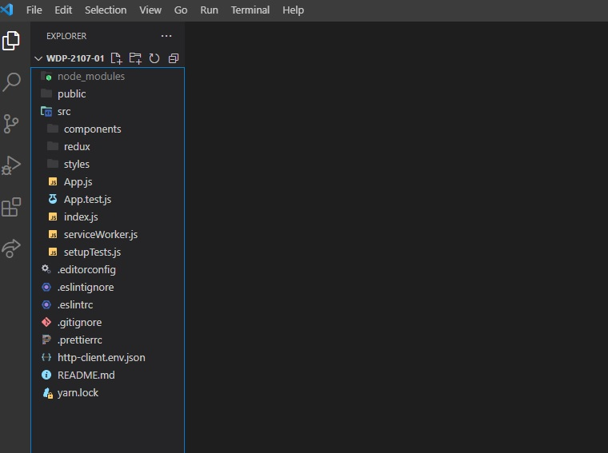

# WDP Projekt Zespołowy

## Opis projektu
> Projekt jest przykładową stroną sklepu meblowego zakodowaną z darmowego szablonu PSD, zgodnie z wytycznymi klienta w oparciu o technologie **JavaScript**, **SCSS**, **Redux**, **React**. Oparta na **Bootstrap**, a więc łatwa w rozbudowie, elastyczna. Lekka, bez obciążających pluginów. Zgodna z **RWD**.

## Demo
> Live demo [_here_](https://stark-journey-58180.herokuapp.com/).

## Spis treści
*  [Ogólne informacje](#ogólne-informacje)
*  [Używane technologie](#używane-technologie)
*  [Struktura katalogów](#struktura-katalogów)
*  [Zrzut ekranu](#zrzut-ekranu)
*  [Inicjacja projektu](#inicjacja-projektu)
*  [NPM Scripts](#npm-scripts)
*  [Git Hooks](#git-hooks)
*  [Konwencje i dobre praktyki](#konwencje-i-dobre-praktyki)
*  [Wykorzystywanie](#wykorzystywanie)
*  [Troubleshooting](#troubleshooting)
*  [Status projektu](#status-projektu)
*  [Podziękowania](#podziękowania)

  
## Ogólne informacje
## Menu
- Dwie wersje językowe do wyboru - polska i angielska.
- Możliwość utworzenia konta lub zakupu bez rejestracji.

## Strona główna
- Możliwość porównania i kupna produktu ze strony głównej. Dla zainteresowanych szczegółowa karta produktu.
- Szybka zmiana ilości wyświetlanych produktów.
- Intuicyjny system oceny produktów.
- Możliwość szybkiej aktualizacji cen z pozostawieniem starej ceny.
- Przyjazny i prosty system zakupu produktu.

## Blog
- Aktualne wpisy w blogu zawsze na wierzchu
- Możliwość edycji i dodawania nowych wpisów
- Możliwość komentowania wpisów

  
## Używane technologie
- Bootstrap: 4.6.0
- SASS - 4.14.0
- Flexbox-grid: 2.1.2

  
## Struktura katalogów
Struktura plików jest ułożona zgodnie z obowiązującymi zasadami:
- katalog źródłowy `src`
-  `components`: (komponenty podzielone na kategorie) `common`, `features`, `layout`, `views`
-  `redux` (pliki związane z obsługą Reduxa)
-  `styles` (każda sekcja posiada oddzielny plik ze stylami .scss )
- nazwy klas odpowiadają poszczególnym sekcjom do których są przypisane

  
## Zrzut ekranu

  
## Inicjacja projektu
Po sklonowaniu projektu, zainstaluj wymagane paczki komendą `yarn install` (lub `npm install`).

Te-raz możesz zacząć pracę, korzystając z przygotowanych taska `yarn start` (lub `npm start`).

Wszystkie potrzebne do pracy pliki źródłowe znajdują się w folderach `src` oraz `public`.

  
## NPM Scripts
Dostępne są 3 główne skrypty przyspieszające pracę:

-  `build`: na bazie plików z folderów `src` i `public` buduje project w folderze `build`.
-  `start`: obserwuje zmiany w folderze `src` i uruchamia podgląd roboczy.
-  `test`: uruchomienie testów jednostkowych.
-  `refactor`: skrypt dokonuje automatycznego formatowania plików w folderze `src/` zgodnie z przyjętą konwencją formatowania kodu, a także sprawdza błędy za pomocą ESLinta.

  
## Git Hooks

Projekt korzysta z Git Hooks - możliwości uruchamiania skryptów w reakcji na wybrane zdarzenia programu Git.
Za każdym razem gdy wykonasz komendę `git commit` zostaną uruchomione testy jednostkowe, formatowanie oraz lintowanie dla plików, które zostały wybrane za pomocą `git add` i mają być zapisane w commicie.

  
## Konwencje i dobre praktyki
Standardy pracy:
- Style wykorzystywane w plikach komponentów. Przypisujemy im zmienne z nazwami kolorów, czyli np. "$footer-claim-bg: $darkGray" w settings.js. Nie korzystamy z styli typu "$white: #ffffff;"
- Stosujemy się do wczesniejszych ustaleń w settings.js oraz na stronie np. czas transition dla hoverów, ich kolorystyka i style.

W celu wydajniejszego workflow:

- Raz w tygodniu uskutecznialiśmy 45min video-spotkanie całego zespołu.
- Codziennie każdy z nas informował resztę o swoich postępach za pomocą DAILY.
- Zadania każdy przypisywał sobie sam z pomocą Jiry.
- Każdy z nas pilnował porządku na tablicy Kanban i dobierał dla siebie 1-3 zadań z samej góry.
- Każdemu zadaniu odpowiadał branch od aktualnego mastera, o tym samym numerze.
- Zdolność do merge posiadał nasz PM, któremu każdorazowo należało wysłać Pull Request z krótkim opisem.
- Commity powinny być w miarę krótkie i zwięzłe, określające co zrobiliśmy lub jaki problem rozwiązaliśmy.
- Przy zakładaniu PR trzymajmy się nazewnictwa tasku z którego tworzymy PR oraz starajmy opisać się problem i rozwiązanie problemu.

## Wykorzystywanie
Większość treści tekstowej w komponentach jest pobierana bezpośrednio ze state, dzięki temu można łatwo edytować np. tekst wyświetlanego komponentu, sekcji oraz dane zdjęcia.

## Troubleshooting
Ze względu na korzystanie z różnego oprogramowania developerów mogą pojawić się konfliky w **package-lock.json** oraz **yarn.lock**. W tym przypadku zaleca się ich usunięcie i reinstalacje `yarn install` albo `npm install`.

## Status projektu
Projekt jest nadal rozbudowywany i stabilizowany.

## Podziękowania
Ogromne podziękowania dla całego zespołu:
-  [_agiskorska_](https://github.com/agiskorska)
-  [_AniaSzwal_](https://github.com/AniaSzwal)
-  [_Myszczyson_](https://github.com/Myszczyson)
-  [_B7atis_](https://github.com/B7atis)

Oraz Mentora:
-  [_PatrykBula_](https://github.com/PatrykBula)
